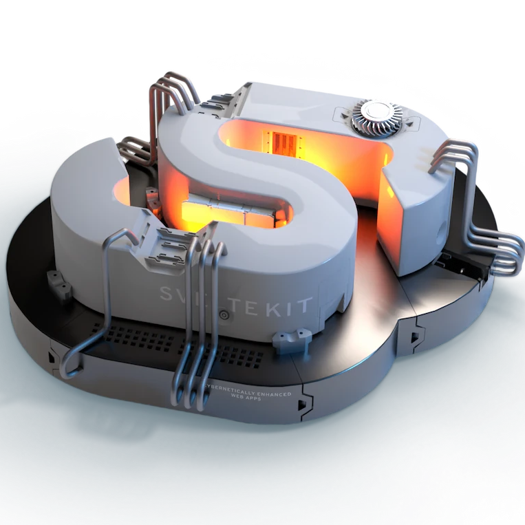
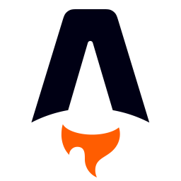

<h1>About </h1>

Languages/Technologies I use
- Hover on icon to show name
- Click on icon for example repository

## Languages

## Technologies

<h1>Metrics </h1>

> For more statistics, see [profile-summary-for-github.com](https://profile-summary-for-github.com/user/floaterest)

<!--
const f = (h1, h2, w2) => {
    const w1 = h2 / h1 * w2;
    const t = w1 + w2;
    console.table({ w1: ((w1/t-0.005)*100).toFixed(2)+'%', w2: ((w2/t-0.005)*100).toFixed(2)+'%' })
}
-->
<!--
-->

<!--
-->
